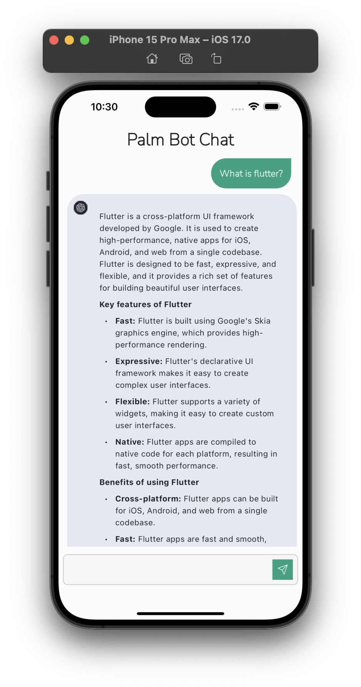

# Palm Bot Chat

An AI chat bot 🤖 Flutter application with data caching using Google's PaLM API (Beta).

## Screenshots

|                    Screen 1                     |                    Screen 2                     |
|:-----------------------------------------------:|:-----------------------------------------------:|
|  |  |

## Configuration

Before testing the application, make sure you obtain an API key by following these steps [lien](https://makersuite.google.com/app/apikey).

## 🔌 Plugins

| Name                                                                | Usage              |
|---------------------------------------------------------------------|--------------------|
| [**Provider**](https://pub.dev/packages/dio)                        | State Management   |
| [**Share Preference**](https://pub.dev/packages/shared_preferences) | Persistent storage |
| [**Flutter Svg**](https://pub.dev/packages/flutter_svg)             | Draw SVG files     |
| [**DIO**](https://pub.dev/packages/dio)                             | Network calls      |
| [**Flutter Mardown**](https://pub.dev/packages/flutter_markdown)    | Markdown renderer  |

## How to test

1. Clone this repository.
```shell
git clone https://github.com/dongorias/palm-bot-chat-app.git
flutter clean
flutter packages get
flutter run
```
2. Add your API key generated from [lien](https://makersuite.google.com/app/apikey) in the configuration file ```lib/config```.
3. Run the application with the command `flutter run`.


## 👨🏾‍💻 Author

**Don Arias Agokoli**
[](https://twitter.com/don_gorias)

## Getting Started

This project is a starting point for a Flutter application.

A few resources to get you started if this is your first Flutter project:

- [Lab: Write your first Flutter app](https://docs.flutter.dev/get-started/codelab)
- [Cookbook: Useful Flutter samples](https://docs.flutter.dev/cookbook)

For help getting started with Flutter development, view the
[online documentation](https://docs.flutter.dev/), which offers tutorials,
samples, guidance on mobile development, and a full API reference.
